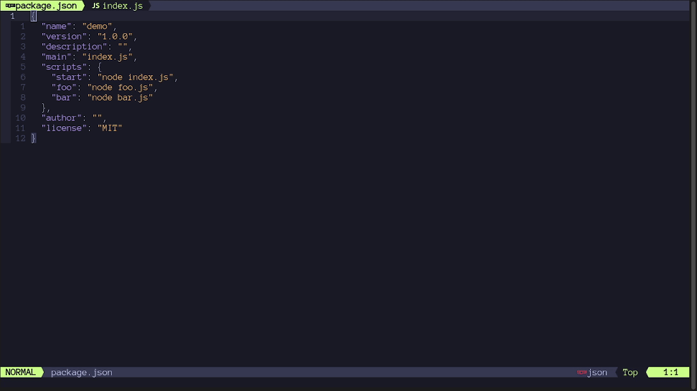

# runner.nvim

A customizable Neovim plugin to run code inside the editor 

## Demo
 

## Table of Contents

- [Installation](#installation)
- [Usage](#usage)
- [Configuration](#configuration)
- [Helpers](#helpers)
- [Advanced handlers configurations](#advanced-handlers-configurations)
- [Contribution](#contribution)

## Installation

  Using [packer.nvim](https://github.com/wbthomason/packer.nvim):

  ```lua
  return require('packer').startup(function(use)
    use {
      'MarcHamamji/runner.nvim',
      requires = {
        'nvim-telescope/telescope.nvim',
        requires = { 'nvim-lua/plenary.nvim' }
      }
    }
  end)
  ```

  Using [lazy.nvim](https://github.com/folke/lazy.nvim):

  ```lua
  require('lazy').setup({
    {
      'MarcHamamji/runner.nvim',
      dependencies = {
        'nvim-telescope/telescope.nvim',
        dependencies = { 'nvim-lua/plenary.nvim' }
      }
    }
  })
  ```

## Usage

  ```lua
  require('runner').run()

  -- To set a mapping
  vim.keymap.set('n', '<leader><space>', require('runner').run)
  ```

## Configuration

  This plugin doesn't have a `setup()` method, but you can set your filetype handlers using the `set_handler()` method.

  Default handlers can be found [here](./lua/runner/handlers/init.lua).

  #### `set_handler(filetype, handler)`
  | Argument name | Description | Type |
  |---------------- | --------------- | --------------- |
  | `filetype` | The filetype on which to run the given handler | `string` |
  | `handler` | The handler to run when the current file matches the filetype | `function(code_buffer_number)`  |

  Example:

  ```lua
  require('runner').set_handler('lua', function(code_buffer_number)
    vim.print('Running lua file in buffer ' .. code_buffer_number)
  end)
  ```

  **Note:** This method overwrites the default handlers set for the specified filetype.

## Helpers
  
  This plugin exposes some helpers to make creating handlers easier. They're all available by importing them as follows:

  ```lua
  local handler_name = require('runner.handlers.helpers').handler_name
  ```

  Here is a description of each one:

  - #### `shell_handler(command, editable)`

    Runs a command in a shell by opening it in a new vertical split window, with a terminal buffer.
    
    | Argument name | Description | Type |
    |---------------- | --------------- | --------------- |
    | `command` | The shell command to run when the handler is called | `string` |
    | `editable`| Whether the user should be prompted to edit the command using `vim.input()` before running it. Useful when giving command line arguments to a script | `boolean` *(optional, defaults to false)* |
    
    Example:

    ```lua
    local shell_handler = require('runner.handlers.helpers').shell_handler
    require('runner').set_handler('rust', shell_handler('cargo run', true))
    ```

  - #### `command_handler(command)`
    
    Runs a command in the Vim command mode.

    | Argument name | Description | Type |
    |---------------- | --------------- | --------------- |
    | `command` | The Vim command to run when the handler is called | `string` |
    
    Example:

    ```lua
    local command_handler = require('runner.handlers.helpers').command_handler
    require('runner').set_handler('lua', command_handler('luafile %'))
    ```

  - #### `choice(handlers)`
    
    Opens a `Telescope` finder to allow the user to choose which handler to run.
    
    | Argument name | Description | Type |
    |---------------- | --------------- | --------------- |
    | `handlers` | The list of handlers to choose from | `table` where the keys are the name of the handlers in the `telescope` finder, and where the values are the actual handlers |
    
    Example:

    ```lua
    local choice = require('runner.handlers.helpers').choice
    require('runner').set_handler('rust', choice({
      ['Run'] = helpers.shell_handler('cargo run'),
      ['Test'] = helpers.shell_handler('cargo test'),
      ['Custom'] = helpers.shell_handler('cargo ', true),
    }))
    ```
## Advanced handlers configurations
  
  For creating dynamic handlers like one for each `npm` or `cargo` script, you can write your own handler function that generates the other handlers, gives them to the choice handler, and runs it itself.
  See [Node.js example](lua/runner/handlers/languages/nodejs/init.lua).

## Contribution

  If you find that some handlers for a specific language are missing, feel free to open a pull request by adding them in the [lua/runner/handlers/init.lua](lua/runner/handlers/init.lua) file.
  
  Licensed under the [MIT license](./LICENSE).
